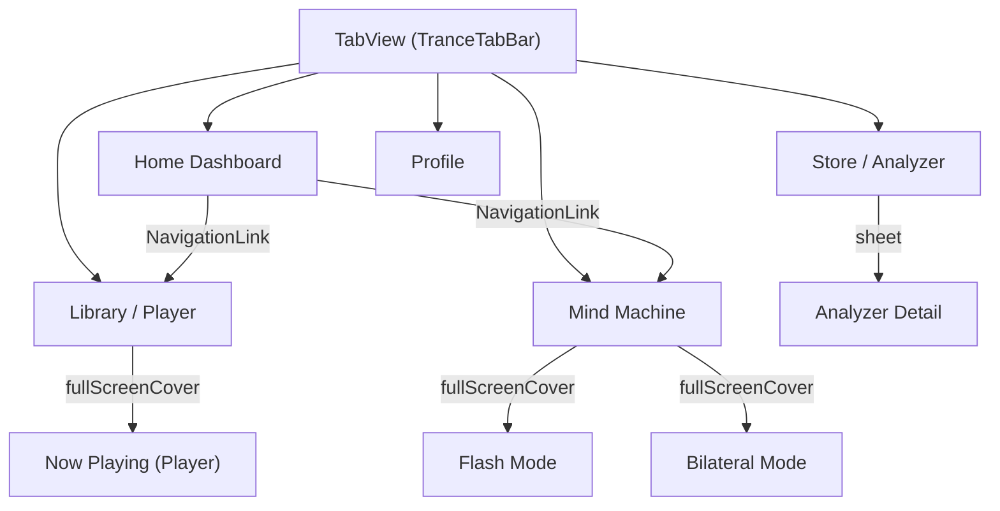

# Trance — SwiftUI Design Specification
## Pink Light Mode

> Complete implementation guide: tokens, components, layouts, animations, and navigation.

---

## 1. Design Tokens

### 1.1 Color Palette

```swift
extension Color {
    // MARK: - Backgrounds
    static let bgPrimary    = Color(hex: "FFF5F7")  // near-white blush
    static let bgSecondary  = Color(hex: "FFECF0")  // soft rose tint
    static let bgCard       = Color(hex: "FFE4E8").opacity(0.55) // glass card fill

    // MARK: - Accents
    static let roseGold     = Color(hex: "D4789A")  // primary accent
    static let roseDeep     = Color(hex: "C06080")  // pressed / CTA gradient end
    static let blush        = Color(hex: "F8C8D4")  // soft highlights
    static let lavender     = Color(hex: "E8D0F0")  // tertiary accent
    static let warmAccent   = Color(hex: "F5C78E")  // amber/warm touches

    // MARK: - Text
    static let textPrimary   = Color(hex: "4A2035")  // dark plum
    static let textSecondary = Color(hex: "8A6075")  // mauve
    static let textLight     = Color(hex: "B08898")  // muted labels

    // MARK: - Borders & Glass
    static let glassBorder  = Color(hex: "E8A0B0").opacity(0.3)
    static let glassFill    = Color.white.opacity(0.15)

    // MARK: - Brainwave Zone Colors
    static let bwDelta  = Color(hex: "8B6BA8")  // indigo
    static let bwTheta  = Color(hex: "B07DC8")  // lavender-purple
    static let bwAlpha  = Color(hex: "D4789A")  // rose
    static let bwBeta   = Color(hex: "E88A9A")  // warm pink
    static let bwGamma  = Color(hex: "F5B87A")  // peach gold

    // MARK: - Hypnosis Phase Colors
    static let phaseIntro         = Color(hex: "78A0D2")  // blue
    static let phaseInduction     = Color(hex: "4ECDC4")  // teal
    static let phaseDeepener      = Color(hex: "8B6BA8")  // indigo
    static let phaseFractionation = Color(hex: "E8A060")  // amber
    static let phaseSuggestion    = Color(hex: "D4789A")  // rose
    static let phaseAwakening     = Color(hex: "F5C78E")  // peach

    // MARK: - Flash Mode Colors
    static let flashOn  = Color(hex: "F8C8D4")  // active pulse
    static let flashOff = Color(hex: "FFF5F7")  // rest state
}
```

### 1.2 Typography

Use **SF Pro / SF Pro Rounded** (system). No custom fonts required.

| Role | Weight | Size | Tracking | Color |
|---|---|---|---|---|
| Screen title | `.semibold` | 18 | 0 | `textPrimary` |
| Greeting | `.light` | 26 | -0.3 | `textPrimary` |
| Greeting accent | `.medium` | 26 | -0.3 | `roseGold` |
| Section title | `.semibold` | 16 | 0 | `textPrimary` |
| Card label | `.semibold` | 11 | 1.2 | `textLight` |
| Body | `.regular` | 14 | 0 | `textPrimary` |
| Caption | `.regular` | 11 | 0 | `textSecondary` |
| Freq display | `.semibold` | 18 | 0 | `roseGold` |
| Track title | `.semibold` | 20 | 0 | `textPrimary` |
| Track artist | `.regular` | 13 | 0 | `textSecondary` |
| Tab label | `.medium` | 10 | 0 | `textLight` / `roseGold` |

All card labels should use `.textCase(.uppercase)`.

### 1.3 Spacing Scale

```
4  — micro gap (between caption lines)
6  — icon-to-label inside cat items
8  — inner card element spacing
10 — between small cards
12 — between list items
14 — card bottom margin / card-to-card
16 — standard card padding
20 — content horizontal inset
22 — screen horizontal padding
28 — status bar horizontal padding
```

### 1.4 Radii

| Element | Radius |
|---|---|
| Phone frame (dev preview) | 48 |
| Glass cards | 18 |
| Category icons | Full circle (`.clipShape(Circle())`) |
| Library thumbnails | 14 |
| CTA buttons | 16 |
| Phase pill | 20 |
| Pattern cards | 18 |
| Tab bar items | 10 |
| Toggle track | 26 (capsule) |

### 1.5 Shadows

```swift
// Card shadow
.shadow(color: Color(hex: "5A3045").opacity(0.05), radius: 10, x: 0, y: 4)

// CTA button shadow
.shadow(color: Color.roseGold.opacity(0.3), radius: 12, x: 0, y: 8)

// Category icon halo glow
.shadow(color: haloColor.opacity(0.3), radius: 10, x: 0, y: 0)

// Elevated card hover
.shadow(color: Color.roseGold.opacity(0.15), radius: 12, x: 0, y: 8)

// Phone frame (dev preview only)
.shadow(color: Color(hex: "5A3045").opacity(0.12), radius: 40, x: 0, y: 25)
```

### 1.6 Blur / Glass Effects

```swift
struct GlassBackground: ViewModifier {
    func body(content: Content) -> some View {
        content
            .background(.ultraThinMaterial)
            .background(Color.bgCard)
            .clipShape(RoundedRectangle(cornerRadius: 18))
            .overlay(
                RoundedRectangle(cornerRadius: 18)
                    .stroke(Color.glassBorder, lineWidth: 1)
            )
            .shadow(color: Color(hex: "5A3045").opacity(0.05), radius: 10, y: 4)
    }
}
```

---

## 2. Reusable Components

### 2.1 `GlassCard`

```swift
struct GlassCard<Content: View>: View {
    let label: String?       // uppercase label, nil to hide
    @ViewBuilder let content: () -> Content

    var body: some View {
        VStack(alignment: .leading, spacing: 10) {
            if let label {
                Text(label)
                    .font(.system(size: 11, weight: .semibold))
                    .tracking(1.2)
                    .textCase(.uppercase)
                    .foregroundColor(.textLight)
            }
            content()
        }
        .padding(16)
        .modifier(GlassBackground())
    }
}
```

### 2.2 `CategoryIcon`

```swift
struct CategoryIcon: View {
    let emoji: String
    let label: String
    let haloColor: Color

    @State private var isHovered = false

    var body: some View {
        VStack(spacing: 6) {
            Text(emoji)
                .font(.system(size: 22))
                .frame(width: 52, height: 52)
                .background(Color.bgCard)
                .clipShape(Circle())
                .overlay(Circle().stroke(Color.glassBorder, lineWidth: 1))
                .shadow(color: haloColor.opacity(isHovered ? 0.5 : 0.3),
                        radius: isHovered ? 14 : 10)
                .scaleEffect(isHovered ? 1.1 : 1.0)
                .animation(.easeInOut(duration: 0.2), value: isHovered)

            Text(label)
                .font(.system(size: 11))
                .foregroundColor(.textSecondary)
        }
    }
}
```

### 2.3 `TranceTabBar`

Five tabs: Home, Library, Mind Machine, Store, Profile.

```swift
enum TranceTab: String, CaseIterable {
    case home      = "🏠"
    case library   = "📚"
    case machine   = "💡"
    case store     = "🛒"
    case profile   = "👤"

    var title: String {
        switch self {
        case .home:    "Home"
        case .library: "Library"
        case .machine: "Machine"
        case .store:   "Store"
        case .profile: "Profile"
        }
    }

    var sfSymbol: String {
        switch self {
        case .home:    "house.fill"
        case .library: "books.vertical.fill"
        case .machine: "lightbulb.fill"
        case .store:   "bag.fill"
        case .profile: "person.fill"
        }
    }
}

struct TranceTabBar: View {
    @Binding var selected: TranceTab

    var body: some View {
        HStack {
            ForEach(TranceTab.allCases, id: \.self) { tab in
                Button {
                    withAnimation(.easeInOut(duration: 0.2)) {
                        selected = tab
                    }
                } label: {
                    VStack(spacing: 2) {
                        Image(systemName: tab.sfSymbol)
                            .font(.system(size: 20))
                        Text(tab.title)
                            .font(.system(size: 10, weight: .medium))
                    }
                    .foregroundColor(selected == tab ? .roseGold : .textLight)
                    .padding(.vertical, 4)
                    .padding(.horizontal, 10)
                }
            }
        }
        .frame(maxWidth: .infinity)
        .padding(.top, 10)
        .padding(.bottom, 28) // safe area
        .background(.ultraThinMaterial)
        .background(Color.bgPrimary.opacity(0.9))
        .overlay(alignment: .top) {
            Rectangle()
                .fill(Color.glassBorder)
                .frame(height: 1)
        }
    }
}
```

### 2.4 `SyncToggle`

```swift
struct SyncToggle: View {
    @Binding var isOn: Bool

    var body: some View {
        HStack {
            Text("Sync Mind Machine")
                .font(.system(size: 14))
                .foregroundColor(.textPrimary)
            Spacer()
            Toggle("", isOn: $isOn)
                .toggleStyle(RoseToggleStyle())
        }
    }
}

struct RoseToggleStyle: ToggleStyle {
    func makeBody(configuration: Configuration) -> some View {
        Capsule()
            .fill(configuration.isOn ? Color.roseGold : Color.glassBorder)
            .frame(width: 46, height: 26)
            .overlay(alignment: configuration.isOn ? .trailing : .leading) {
                Circle()
                    .fill(.white)
                    .frame(width: 20, height: 20)
                    .shadow(color: .black.opacity(0.1), radius: 2, y: 2)
                    .padding(3)
            }
            .animation(.easeInOut(duration: 0.2), value: configuration.isOn)
            .onTapGesture { configuration.isOn.toggle() }
    }
}
```

### 2.5 `CTAButton`

```swift
struct CTAButton: View {
    let title: String
    let gradient: [Color]
    let action: () -> Void

    init(_ title: String,
         gradient: [Color] = [.roseGold, .roseDeep],
         action: @escaping () -> Void) {
        self.title = title
        self.gradient = gradient
        self.action = action
    }

    @State private var isPressed = false

    var body: some View {
        Button(action: action) {
            Text(title)
                .font(.system(size: 16, weight: .semibold))
                .foregroundColor(.white)
                .frame(maxWidth: .infinity)
                .padding(.vertical, 16)
                .background(
                    LinearGradient(colors: gradient,
                                   startPoint: .topLeading,
                                   endPoint: .bottomTrailing)
                )
                .clipShape(RoundedRectangle(cornerRadius: 16))
                .shadow(color: Color.roseGold.opacity(0.3), radius: 12, y: 8)
                .scaleEffect(isPressed ? 0.97 : 1.0)
                .offset(y: isPressed ? 2 : 0)
        }
        .buttonStyle(PlainButtonStyle())
        .onLongPressGesture(minimumDuration: .infinity, pressing: { pressing in
            withAnimation(.easeInOut(duration: 0.15)) { isPressed = pressing }
        }, perform: {})
    }
}
```

### 2.6 `PhasePill`

```swift
struct PhasePill: View {
    let phase: String   // e.g. "Deepener Phase"

    var body: some View {
        Text(phase)
            .font(.system(size: 12, weight: .medium))
            .foregroundColor(.roseDeep)
            .padding(.horizontal, 16)
            .padding(.vertical, 5)
            .background(
                LinearGradient(colors: [.blush, Color.roseGold.opacity(0.3)],
                               startPoint: .topLeading, endPoint: .bottomTrailing)
            )
            .clipShape(Capsule())
    }
}
```

### 2.7 `ProgressRingView`

```swift
struct ProgressRingView: View {
    let progress: Double  // 0.0–1.0

    var body: some View {
        ZStack {
            Circle()
                .stroke(Color.glassBorder, lineWidth: 2)
            Circle()
                .trim(from: 0, to: progress)
                .stroke(Color.roseGold, style: StrokeStyle(lineWidth: 2.5, lineCap: .round))
                .rotationEffect(.degrees(-90))
            Text("\(Int(progress * 100))%")
                .font(.system(size: 10, weight: .semibold))
                .foregroundColor(.roseGold)
        }
        .frame(width: 44, height: 44)
    }
}
```

### 2.8 `AudioScrubber`

```swift
struct AudioScrubber: View {
    @Binding var progress: Double  // 0.0–1.0

    var body: some View {
        GeometryReader { geo in
            ZStack(alignment: .leading) {
                Capsule()
                    .fill(Color.roseGold.opacity(0.2))
                Capsule()
                    .fill(
                        LinearGradient(colors: [.roseGold, .blush],
                                       startPoint: .leading, endPoint: .trailing)
                    )
                    .frame(width: geo.size.width * progress)
            }
        }
        .frame(height: 4)
        .gesture(
            DragGesture(minimumDistance: 0)
                .onChanged { v in
                    // update progress from drag
                }
        )
    }
}
```

### 2.9 `WaveformView` (mini + full)

```swift
struct WaveformView: View {
    let samples: [CGFloat]  // normalized 0–1
    let color: Color

    var body: some View {
        GeometryReader { geo in
            Path { path in
                let w = geo.size.width / CGFloat(samples.count - 1)
                let h = geo.size.height
                path.move(to: CGPoint(x: 0, y: h * (1 - samples[0])))
                for i in 1..<samples.count {
                    let x = CGFloat(i) * w
                    let y = h * (1 - samples[i])
                    let cp = CGPoint(x: x - w/2, y: h * (1 - samples[i-1]))
                    path.addQuadCurve(to: CGPoint(x: x, y: y), control: cp)
                }
            }
            .stroke(color, lineWidth: 2)
        }
    }
}
```

### 2.10 `IntensityDial`

```swift
struct IntensityDial: View {
    @Binding var intensity: Double  // 0.0–1.0

    var body: some View {
        ZStack {
            Circle()
                .trim(from: 0, to: intensity)
                .stroke(Color.roseGold, style: StrokeStyle(lineWidth: 10, lineCap: .round))
                .rotationEffect(.degrees(-90))
            Circle()
                .fill(Color.bgSecondary)
                .padding(10)
            Text("\(Int(intensity * 100))%")
                .font(.system(size: 22, weight: .bold))
                .foregroundColor(.roseGold)
        }
        .frame(width: 100, height: 100)
        .gesture(
            DragGesture()
                .onChanged { value in
                    // Convert drag to 0–1 intensity via angle
                }
        )
    }
}
```

---

## 3. Screen Layouts

### 3.1 Home Dashboard

```
┌────────────────────────────────────────┐
│ StatusBar                    9:41  ⦿⦿⦿ │  padding: 16t, 28h, 8b
├────────────────────────────────────────┤
│ ScrollView(.vertical) {               │  padding: 22h
│                                        │
│   "Good evening, Alex"     .light 26   │  mb: 2
│   "Ready to unwind?"       .reg 14     │  mb: 20
│                                        │
│   HStack(spacing: auto) {             │  .spaceEvenly
│     [🌙Sleep] [🎯Focus] [⚡Energy]    │  CategoryIcon × 5
│     [🧘Relax] [🌀Trance]             │  mb: 20
│   }                                    │
│                                        │
│   GlassCard("Continue Session") {      │  mb: 14
│     HStack(12) {                       │
│       WaveformView(120×30)             │
│       VStack { title + caption }       │
│       ProgressRingView(44×44, 0.6)     │
│     }                                  │
│   }                                    │
│                                        │
│   Text("Quick Start Mind Machine")     │  .semibold 16, mb: 10
│   HStack(10) {                         │
│     MiniCard("Alpha Waves", "10 Hz")   │  flex 1:1
│     MiniCard("Theta Drift", "6 Hz")    │
│   }                                    │  mb: 16
│                                        │
│   Text("Your Library")                 │  .semibold 16, mb: 10
│   ScrollView(.horizontal) {            │
│     HStack(10) {                       │
│       LibThumb(72×72, gradient) × 4+   │
│     }                                  │
│   }                                    │
│ }                                      │
├────────────────────────────────────────┤
│ TranceTabBar(selected: .home)          │
└────────────────────────────────────────┘
```

### 3.2 Audio Player

```
┌────────────────────────────────────────┐
│ StatusBar                              │
├────────────────────────────────────────┤
│ NavTop:  ‹ back   "Now Playing"   ⋯   │  padding: 22h
│                                        │
│ ScrollView {                           │  .center aligned
│                                        │
│   MandalaVisualizer(220×220)           │  centered, mb: 20
│   ┌──────────────────────┐             │
│   │ 4 concentric rings   │             │  animated pulse
│   │ + glowing core dot   │             │  (see §4.2)
│   └──────────────────────┘             │
│                                        │
│   "Deep Sleep Induction"  .semi 20     │  mb: 0
│   "Dr. Sarah Mitchell"   .reg 13      │  mb: 12
│   PhasePill("Deepener Phase")          │  mb: 16
│                                        │
│   SyncToggle(isOn: $syncMM)            │  full width, mb: 16
│                                        │
│   AudioScrubber(progress: 0.3)         │  mb: 6
│   HStack { "18:24"  Spacer  "-42:16" } │  .sys 11, textLight
│                                        │
│   HStack(20) {                         │  centered
│     ⇆(18)  ⏮(18)  ▶(60×60)  ⏭(18)  ↻(18)│
│   }                                    │
│   ───── play button is gradient circle │  roseGold → roseDeep
│         with white shadow              │
│                                        │
│   "Up Next"  .semibold 16             │  mt: 24, mb: 10
│   GlassCard { UpNextItem × 2 }        │
│ }                                      │
├────────────────────────────────────────┤
│ TranceTabBar(selected: .library)       │
└────────────────────────────────────────┘
```

### 3.3 Mind Machine Session

```
┌────────────────────────────────────────┐
│ StatusBar                              │
├────────────────────────────────────────┤
│ NavTop:  ‹   "Mind Machine"   ⋯       │
│                                        │
│ ScrollView {                           │
│                                        │
│   LightVisualization(h:160)            │  full width
│   ┌──────────────────────┐             │
│   │ radialGradient bg    │             │  blush→transparent
│   │ PulseOrb(90×90)      │             │  breathing animation
│   └──────────────────────┘             │  mb: 16
│                                        │
│   GlassCard("Frequency") {            │
│     Slider(1...40, value: 10)          │  custom styled (§2)
│     HStack { δ  θ  α  β  γ }          │  brainwave labels
│     "10 Hz · Alpha"  .semi 18 rose    │
│   }                                    │
│                                        │
│   GlassCard("Color Temperature") {     │
│     HStack(14) { ColorDot × 5 }       │  36×36 circles
│   }                                    │  selected = border + scale
│                                        │
│   Text("Pattern")                      │  card label style
│   ScrollView(.horizontal) {            │
│     HStack(8) {                        │
│       PatternCard × 4 (18r, 10v 14h)  │  active = gradient bg
│     }                                  │
│   }                                    │  mb: 14
│                                        │
│   GlassCard("Intensity") {            │
│     IntensityDial(100×100)             │  centered
│   }                                    │
│                                        │
│   CTAButton("Start Session")           │  roseGold→roseDeep
│ }                                      │
├────────────────────────────────────────┤
│ TranceTabBar(selected: .machine)       │
└────────────────────────────────────────┘
```

### 3.4 Full-Screen Flash

```
┌────────────────────────────────────────┐
│                                        │
│          ENTIRE SCREEN fills           │
│       with flashOn / flashOff          │  no chrome
│       alternating at freq Hz           │
│                                        │
│                                        │
│              "03:24 remaining"         │  .sys 14, mauve, 0.4 opacity
│              "Tap to reveal controls"  │  .sys 12, mauve, 0.25 opacity
│                                        │
│   [✕ Exit] top-right, pill bg          │  tap → back to Mind Machine
└────────────────────────────────────────┘
```

- The screen pulses between `flashOn (#F8C8D4)` and `flashOff (#FFF5F7)` at the selected Hz.
- Tapping anywhere reveals a frosted overlay with the controls from the Mind Machine screen.
- `UIScreen.main.brightness` should be set to 1.0 on entry, restored on exit.

### 3.5 Bilateral Drift

```
┌───────────────────┬───────────────────┐
│                   │                   │
│   LEFT HALF       │   RIGHT HALF      │
│   pulses ON       │   pulses OFF      │  alternating
│                   │                   │
│                   │                   │
│        "Bilateral Drift · 03:24"      │  centered at bottom
│                                        │
│   [✕ Exit] top-right                   │
└────────────────────────────────────────┘
```

- Vertical 50/50 split. Left and right alternate: when left = `flashOn`, right = `flashOff`, then swap.
- Phase offset = 0.5 of the period (half-cycle delay between sides).

### 3.6 Audio Analyzer & Light Script Builder

```
┌────────────────────────────────────────┐
│ StatusBar                              │
├────────────────────────────────────────┤
│ NavTop:  ‹   "Audio Analyzer"   ⋯     │
│                                        │
│ ScrollView {                           │
│                                        │
│   GlassCard("Waveform Analysis") {     │
│     ZStack {                           │
│       HStack(0) {                      │  6 colored rect zones
│         PhaseZoneRect × 6              │  opacity 0.15 each
│       }                                │
│       WaveformView(full-width, h:60)   │  roseGold stroke
│     }                                  │
│   }                                    │
│                                        │
│   GlassCard("Detected Phases") {       │
│     VStack(8) {                        │
│       PhaseRow(dot, name, timerange)×6 │  dot=10×10 circle
│     }                                  │
│   }                                    │
│                                        │
│   GlassCard("Light Script Preview") {  │
│     RoundedRect(h:24, r:12)            │  6-color linear gradient
│   }                                    │  opacity 0.7
│                                        │
│   GlassCard("Customize Script") {      │
│     HStack(8) {                        │
│       CustomItem("Freq Range","4-12")  │  flex 1:1:1
│       CustomItem("Target","Deep Tr.")  │  white bg, 12r
│       CustomItem("Ramp Time","Auto")   │
│     }                                  │
│   }                                    │
│                                        │
│   CTAButton("Generate Light Script ✦") │
│     gradient: [.bwDeepener, .roseGold] │  indigo → rose-gold
│ }                                      │
├────────────────────────────────────────┤
│ TranceTabBar(selected: .store)         │
└────────────────────────────────────────┘
```

---

## 4. Animations & Transitions

### 4.1 Pulse Orb (Mind Machine)

```swift
struct PulseOrb: View {
    @State private var scale: CGFloat = 1.0

    var body: some View {
        Circle()
            .fill(
                RadialGradient(
                    colors: [Color.roseGold.opacity(0.8), Color.blush.opacity(0.3)],
                    center: .center, startRadius: 0, endRadius: 45
                )
            )
            .frame(width: 90, height: 90)
            .shadow(color: Color.roseGold.opacity(0.4), radius: 30)
            .shadow(color: Color.blush.opacity(0.2), radius: 60)
            .scaleEffect(scale)
            .onAppear {
                withAnimation(.easeInOut(duration: 2.0).repeatForever(autoreverses: true)) {
                    scale = 1.15
                }
            }
    }
}
```

### 4.2 Mandala Visualizer (Player)

Four concentric rings pulsing at staggered intervals:

```swift
struct MandalaVisualizer: View {
    @State private var pulse = false

    let rings: [(size: CGFloat, opacity: Double, delay: Double)] = [
        (220, 0.2, 0.0),
        (170, 0.3, 0.5),
        (120, 0.4, 1.0),
        (70,  0.5, 1.5)
    ]

    var body: some View {
        ZStack {
            ForEach(rings.indices, id: \.self) { i in
                Circle()
                    .stroke(Color.roseGold.opacity(rings[i].opacity), lineWidth: 2)
                    .frame(width: rings[i].size)
                    .scaleEffect(pulse ? 1.08 : 1.0)
                    .opacity(pulse ? 0.6 : 1.0)
                    .animation(
                        .easeInOut(duration: 4.0)
                        .repeatForever(autoreverses: true)
                        .delay(rings[i].delay),
                        value: pulse
                    )
            }
            // Core glow dot
            Circle()
                .fill(
                    RadialGradient(colors: [.roseGold, .blush],
                                   center: .center, startRadius: 0, endRadius: 15)
                )
                .frame(width: 30, height: 30)
                .shadow(color: Color.roseGold.opacity(0.5), radius: 15)
        }
        .frame(width: 220, height: 220)
        .onAppear { pulse = true }
    }
}
```

### 4.3 Flash Modes

```swift
struct FlashView: View {
    let frequency: Double  // Hz
    @State private var isOn = true

    var body: some View {
        Color(isOn ? .flashOn : .flashOff)
            .ignoresSafeArea()
            .onAppear { startFlashing() }
    }

    func startFlashing() {
        let interval = 1.0 / (frequency * 2)  // half-period
        Timer.scheduledTimer(withTimeInterval: interval, repeats: true) { _ in
            isOn.toggle()
        }
    }
}

struct BilateralFlashView: View {
    let frequency: Double
    @State private var leftOn = true

    var body: some View {
        HStack(spacing: 0) {
            Color(leftOn ? .flashOn : .flashOff)
            Color(leftOn ? .flashOff : .flashOn)
        }
        .ignoresSafeArea()
        .onAppear {
            Timer.scheduledTimer(withTimeInterval: 1.0 / (frequency * 2), repeats: true) { _ in
                leftOn.toggle()
            }
        }
    }
}
```

> [!CAUTION]
> Flash frequencies above 20 Hz may cause issues for photosensitive users. Include a safety warning on first launch and respect `UIAccessibility.isReduceMotionEnabled`.

### 4.4 Screen Transitions

| Transition | Animation | Duration |
|---|---|---|
| Tab switch | `.opacity` crossfade | 0.25s ease |
| Push to Player | `.move(edge: .trailing)` + `.opacity` | 0.3s spring(0.8, 0.7) |
| Push to Mind Machine | Same as above | 0.3s spring |
| Enter Flash mode | `.opacity` with `.ignoresSafeArea` | 0.4s easeOut |
| Exit Flash mode | `.opacity` | 0.3s easeIn |
| Card press | `.scaleEffect(0.97)` + `.offset(y: 2)` | 0.15s easeInOut |
| Category hover | `.scaleEffect(1.1)` + shadow bloom | 0.2s easeInOut |
| Toggle flip | Capsule fill color + thumb `.leading`↔`.trailing` | 0.2s easeInOut |
| Orb pulse | `.scaleEffect` 1.0↔1.15 | 2.0s repeatForever |
| Mandala rings | `.scaleEffect` 1.0↔1.08, `.opacity` | 4.0s repeatForever, staggered 0.5s |
| Slider drag | No animation (direct tracking) | — |
| Color dot select | `.scaleEffect(1.15)` + border + shadow | 0.2s spring |
| Pattern card select | Background gradient swap | 0.2s easeInOut |

### 4.5 Haptic Feedback

| Action | Haptic |
|---|---|
| Tab switch | `.light` impact |
| Play/Pause | `.medium` impact |
| Toggle flip | `.light` impact |
| Color dot select | `.selection` |
| Slider snap to zone | `.light` impact |
| Start Session CTA | `.medium` impact |
| Enter Flash | `.heavy` impact |

```swift
let lightImpact = UIImpactFeedbackGenerator(style: .light)
let mediumImpact = UIImpactFeedbackGenerator(style: .medium)
let selectionFeedback = UISelectionFeedbackGenerator()
```

---

## 5. Navigation Architecture



```swift
struct ContentView: View {
    @State private var selectedTab: TranceTab = .home

    var body: some View {
        ZStack(alignment: .bottom) {
            TabView(selection: $selectedTab) {
                NavigationStack { HomeView() }
                    .tag(TranceTab.home)
                NavigationStack { LibraryView() }
                    .tag(TranceTab.library)
                NavigationStack { MindMachineView() }
                    .tag(TranceTab.machine)
                NavigationStack { StoreView() }
                    .tag(TranceTab.store)
                NavigationStack { ProfileView() }
                    .tag(TranceTab.profile)
            }
            // custom tab bar overlays native one
            TranceTabBar(selected: $selectedTab)
        }
    }
}
```

---

## 6. Asset Requirements

| Asset | Type | Notes |
|---|---|---|
| SF Symbols throughout | System | `house.fill`, `books.vertical.fill`, `lightbulb.fill`, `bag.fill`, `person.fill`, `play.fill`, `backward.fill`, `forward.fill`, `shuffle`, `repeat`, `chevron.left`, `ellipsis` |
| App icon | Image | Rose-gold mandala on blush background |
| Launch screen | Storyboard | Solid `bgPrimary` with centered app name in `roseGold` |
| Audio waveform data | Runtime | Generate from `AVAudioFile` amplitude samples |
| Phase detection model | ML/Rule | Either CoreML model or heuristic amplitude + silence analysis |

---

## 7. Accessibility

- All interactive elements get `.accessibilityLabel` and `.accessibilityHint`
- Flash modes must check `UIAccessibility.isReduceMotionEnabled` — if true, show static color instead of flashing
- Minimum contrast ratios: `textPrimary` on `bgPrimary` = 8.2:1 ✅, `textSecondary` on `bgCard` = 4.8:1 ✅, `roseGold` on white = 3.9:1 (use for decorative only, not critical text)
- Support Dynamic Type for all labels (use `.font(.system(size:weight:))` with `.dynamicTypeSize` modifier)
- VoiceOver: Announce phase changes, frequency zone transitions, and flash mode status

---

## 8. Reference Screenshots

````carousel

<!-- slide -->

<!-- slide -->

<!-- slide -->

````
